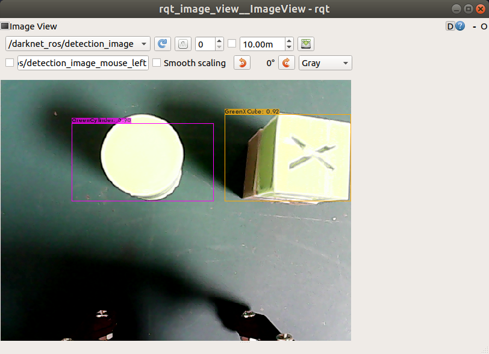

# Jessiarm 

## DIY RobotArm with ROS Molodic + Donkeycar!!   
This project is about ROS Package for Robot Arm with DIY robot     
Robot 3D model, BOM: Byungki     
Circuit: Byungki, ZETA7          
ROS code: ZETA7     

# Especially Thanks
Road-Balance: https://github.com/Road-Balance/donkey_ros
Other Open Source sites 

<p align="center">
    
    
    
    
</p>

There's Notion Lecture Notes and Youtube video's about this project. 
But, It's written in Korean. Anyway, Here's the link

* [Notion Lecture Notes] https://www.notion.so/JessiArm-be431f54912b472fb7f8977e5499612d


## Tested System information

**Jetson Nano 2GB + USB camera**

* Ubuntu 18.04
* ROS Melodic
* Opencv3.4.6

## Packages with Brief Explanation

```
├── jessiarm_csicamera => Handling Image data for USB camera 
├── jessiarm_control => Control DIY Arm with Adafruit PCA9685
├── jessiarm_cv => Computer Vision Package with Opencv3.4.6
├── jessiarm_joy => Control DIY Arm with Gamepad 
├── jessiarm_description => Control RC Car with Gamepad 
├── jessiarm_moveit => Control RC Car with Gamepad 
│
(...)
├── Images
├── LICENSE
├── README.md
```

## Prerequisite

1. ROS Packages installation
   
```bash
$ sudo apt-get install ros-melodic-cv-bridge
$ sudo apt-get install ros-melodic-image-view
```

2. Clone this Repo

```bash
$ cd ~/catkin_ws/src
$ git clone https://github.com/zeta0707/jessiarm.git

$ cd ../
$ catkin_make
$ source devel/setup.bash
```

### **1. joy_control**

Control RobotArm with game controller

<p align="center">
    <video src="/Images/arm_joystick.mkv" width="500" />
</p>

```bash
# Jetson
$ roscore

# Jetson
$ rosrun donkey_control joy_control.py

# Laptop or Jetson
$ roslaunch donkey_joy joy_teleop_axes.launch


왼쪽 레버 좌우: motor0 회전
왼쪽 레버 상하: motor1 기울어짐
오른쪽 레버 좌우: gripper 회전
오른쪽 레버 상하: motor2,3 기울어짐
왼쪽 조그셔틀 상하: Gripper open/close
```

### **2. keyboard_control**

Control RobotArm with keyboard

<p align="center">
    <video src="Images/arm_keyboard.mkv" width="500" />
</p>

```bash
# Jetson
$ roscore

# Jetson
$ rosrun teleop_twist_keyboard teleop_twist_keyboard.py

# Laptop or Jetson
$ roslaunch donkey_joy joy_teleop_axes.launch

j l: 로봇암 좌우
i , : motor0 기울어짐
o . : motor2,3 기울어짐
u m : gripper 회전
t b: gripper 열림, 닫힘
```

### **3. Blob pick and plance**

Find the any color box of the Jetson Nano on the screen. then pick it then place

<p align="center">
    
</p>


```bash
$ roslaunch donkey_control blob_control.launch
```

Debugging with `image_view`

```bash
rosrun image_view image_view image:=/webcam_image
rosrun image_view image_view image:=/blob/image_mask
rosrun image_view image_view image:=/blob/image_blob
```

### **4. Yolo pick and place**

Find the object of the Jetson Nano on the screen, pick it then place


<p align="center">
    <video src="Images/arm_yolo.mkv" width="500" />
</p>


```bash
#terminal #1, #object detect using Yolo_v4
zeta@zeta-nano:~/catkin_ws$ roslaunch darknet_ros yolo_v4.launch

#terminal #2
zeta@zeta-nano:~/catkin_ws$ roslaunch donkey_control yolo_chase.launch
```

### **5. Moveit state publisher**

moveit planner -> Move robot arm accordingly

<p align="center">
    <video src='Images/moveit_statepublish.mkv' width=500 />
</p>

```bash
#terminal #1, Laptop
zeta@zeta-nano:~/catkin_ws$ roslaunch jessi_arm_description jessiarm.launch

#terminal #2, Jetson
zeta@zeta-nano:~/catkin_ws$ rosrun donkey_control chase_moveit.py
```

### **6. Moveit planner**

joint_states publisher -> Move robot arm accordingly  

<p align="center">
    <video src='Images/moveit_planner.mkv' width=500 />
</p>

```bash
#terminal #1, Laptop
zeta@zeta-nano:~/catkin_ws$ roslaunch jessi_arm_moveit demo.launch

#terminal #2, Jetson
zeta@zeta-nano:~/catkin_ws$ rosrun donkey_control chase_moveit.py
```