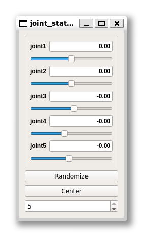
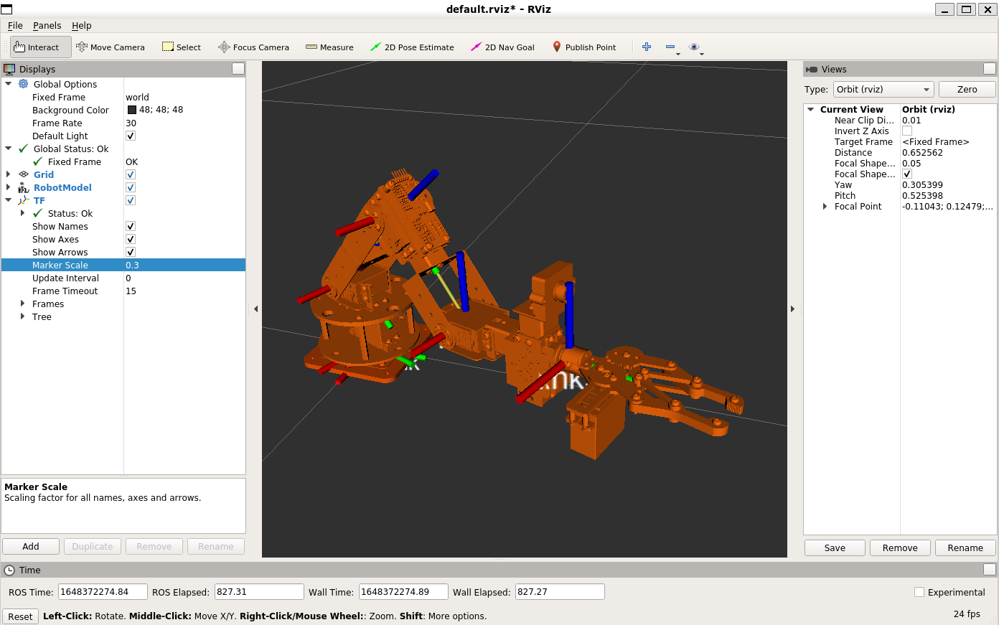

# URDF for Jessi Arm
Robot description of Jessi Arm using xacro.
- Jessi Arm is 5 DoF manipulator
- There is five joints
- Gripper joint ignored


### Check .xacro files with check_urdf.
```bash
$ check_urdf <(xacro jessiarm_robot.xacro)
robot name is: jessiarm
---------- Successfully Parsed XML ---------------
root Link: world has 1 child(ren)
    child(1):  base_link
        child(1):  link1
            child(1):  link2
                child(1):  link3
                    child(1):  link4
                        child(1):  link5
```

### Use urdf_to_graphiz to visually check the .xacro.
```bash
$ urdf_to_graphiz <(xacro jessiarm_robot.xacro)
Created file jess_arm.gv
Created file jessiarm.pdf
$ evince jessiarm.pdf
```

### jessiarm.launch
```bash
roslaunch jessiarm_description jessiarm.launch
```
<p align="center">
    
</p>

### launch rviz

```bash
rviz
```
<p align="center">
    
</p>
